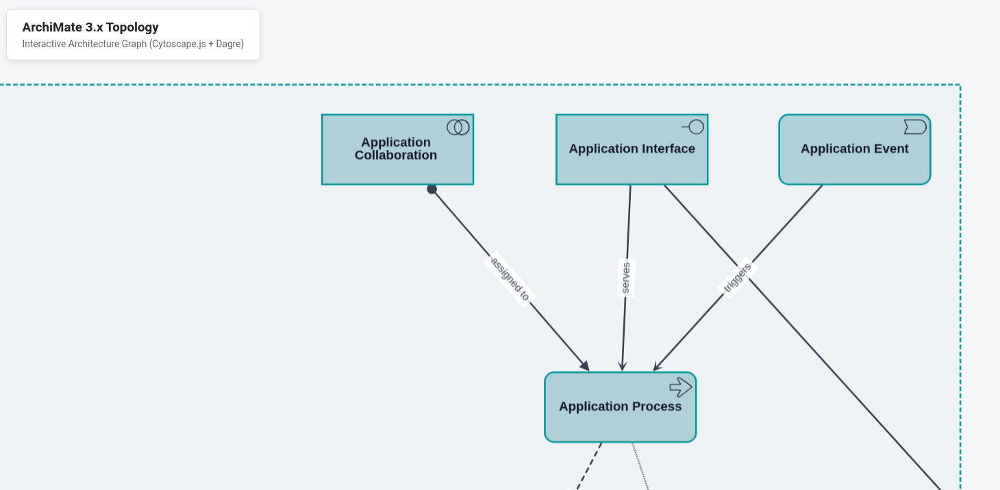

# archimate-in-a-webpage
ArchiMate 3.x topology visualizer: Cytoscape.js diagram with 59 concepts across 7 layers, badge icons, and typed relationships

The images folder contains all Archimate badges as SVG

